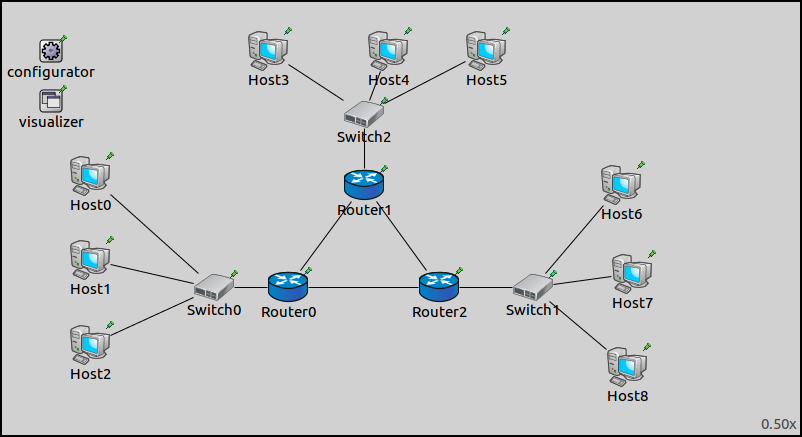
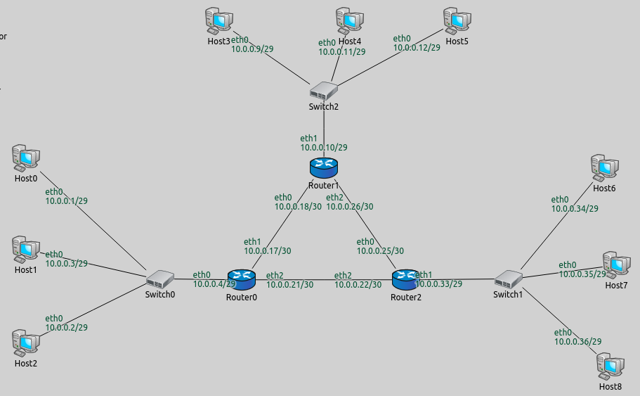

## Goals

In many scenarios, `IPv4NetworkConfigurator` can properly configure IP addresses in a network with its default settings, without
any user input. This is useful when it is irrelevant what the nodes' actual IP addresses are in a simulation
(this step deals with IP addresses only, routing will be discussed in later steps).

## The model

###  About IPv4NetworkConfigurator

In INET simulations, configurator modules are responsible for assigning IP addresses to network nodes, and for setting up their
routing tables. Essentially, configurator modules simulate a real life network administrator. There are various configurator models in INET (`IPv4NetworkConfigurator`, `FlatNetworkConfigurator`, etc.), but this tutorial is about the features of `IPv4NetworkConfigurator`, 
which we will refer to as **configurator**. The following is a broad review of the configurator's features and operation,
these and others will be discussed in detail in the following steps.

The configurator assigns IP addresses to interfaces, and sets up static routing in IPv4 networks.
It doesn't configure IP addresses and routes directly, but stores the configuration in its internal data structures.
Network nodes contain an instance of `IPv4NodeConfigurator`, which configures the corresponding node's interface table and routing table
based on information contained in the global `IPv4NetworkConfigurator` module.

The configurator supports automatic and manual network configuration, and their combinations. By default,
the configuration is fully automatic, but the user can specify parts (or all) of the configuration manually, and the rest
will be configured automatically by the configurator. The configurator's various features can be turned on and off with NED parameters. The details of the configuration, such as IP addresses and routes, can be specified in an XML configuration file.

### The configuration

The configuration for this step uses the `ConfiguratorA` network, defined in <i>ConfiguratorA.ned</i>.
The network looks like this:

The network contains three routers, each connected to the other two. There are three subnetworks with `StandardHosts`, connected to the routers by ethernet switches.
It also contains an instance of `IPv4NetworkConfigurator`.

The configuration for this step in omnetpp.ini is the following: 

<pre class="snippet" src="../omnetpp.uncommented.ini" from="Step1" until="####"></pre>

The configuration for Step 1 is basically empty. The configurator configures addresses according to its default parameters, and using the default XML configuration.

The default parameters pertaining to IP address assignment are the following:

<pre class="snippet">
assignAddresses = default(true);
assignDisjunctSubnetAddresses = default(true);
</pre>

- `assignAddresses = true` tells the configurator to assign IP addresses to interfaces. It assigns addresses based on the supplied XML configuration,
or the default XML configuration if none is specified. Since no XML configuration is specified in this step, it uses the default configuration.

- `assignDisjunctSubnetAddresses = true` sets that the configurator should assign different address prefixes and netmasks
to nodes on different links (nodes are considered to be on the same link if they can reach each other directly, or through L2 devices only.)

Additionally, the `dumpAddresses` parameter sets whether the configurator prints assigned IP addresses to the module output.
This is false by default, but it's set to true in the `General` configuration at the beginning of omnetpp.ini (along with other settings, which
will be discussed later.)

Network interface information, such as interface names and IP addresses, can be visualized by the `InterfaceTableCanvasVisualizer` module, which is included in the network as a submodule of `IntegratedCanvasVisualizer`. In the `General` configuration, interface visualization is turned on, and set to not visualize interface information for switches and access points for clarity, as these don't have IP addresses.

<pre class="snippet" src="../omnetpp.uncommented.ini" from="General" until="####"></pre>

An XML configuration can be supplied with the `config` parameter. When the user doesn't specify an XML configuration,
the configurator will use the following default configuration:

`config = default(xml("<config><interface hosts='**' address='10.x.x.x' netmask='255.x.x.x'/></config>"))`

The default XML configuration tells the configurator to assign IP addresses to all interfaces of all hosts, 
from the IP range 10.0.0.0 - 10.255.255.255 and netmask range 255.0.0.0 - 255.255.255.255.

## Results

The IP addresses assigned to interfaces by the configurator are shown on the image below.
The switches and hosts connected to the individual routers are considered to be on the same link.
Note that the configurator assigned addresses sequentially starting from 10.0.0.1, while making sure that different subnets got different address prefixes and netmasks,
as instructed by the `assignDisjunctSubnetAddresses` parameter.

Note that the configurator assigned a 29 bit netmask to the hosts and the router interfaces connecting to the switches, and a 30 bit netmask
to the other router interfaces. Three hosts and the router's interface towards a switch as a group has four interfaces, thus a 30 bit netmask/2 bit host identifier
would have sufficed. However, the configurator doesn't assign addresses where the host identifier (part of the address not covered by the subnet mask) is all-zeros or all-ones (indicating subnet zero and the subnet broadcast address.)