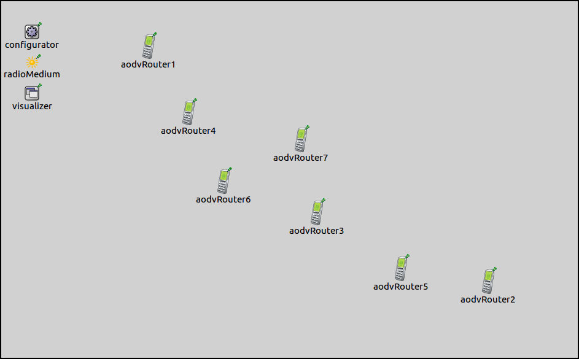
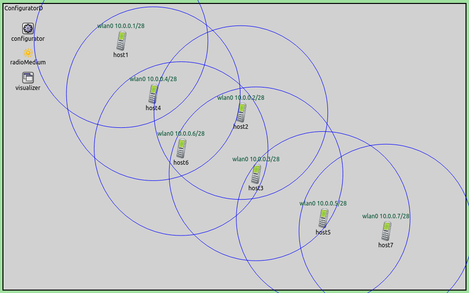
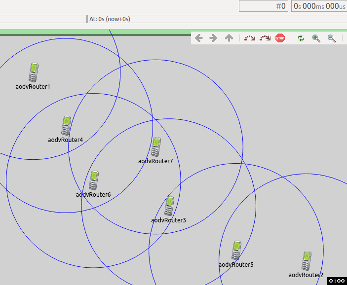

## Goals

This step demonstrates using the error rate metric for configuring static routes. It also demonstrates leaving the routing tables unconfigured, so a dynamic routing protocol can configure them. The step consists of three parts:

- @ref s10a
- @ref s10b
- @ref s10c

## Part A: Static routing based on error rate metric

The topology of completely wireless networks is unclear in a static analysis. By default, the configurator assumes all nodes can directly talk to each other.
When they can't, the error rate metric can be used for automatic route configuration instead of the default hop count.

### Configuration

This step uses the <i>ConfiguratorD</i> network, defined in ConfiguratorD.ned. The network looks like this:

It contains eight <tt>AODVRouters</tt> laid out in a chain.

The configuration for this part in omnetpp.ini is the folowing:

@dontinclude omnetpp.uncommented.ini
@skipline Step10A
@until ####

The transmitter power of radios determine their communication range. The range is set up so hosts are only in range of the adjacent hosts in the chain.
<tt>RoutingTableCanvasVisualizer</tt> is set to visualize routes to all destinations. The routing table visualization is simplified by turning off arrow labels, and setting the arrow line shift to 0. The latter setting causes the visualizer to draw only one arrow between any nodes even if there would be multiple arrows, e.g. one for both directions (bi-directional routes will be displayed as bi-directional arrows now.) Communication ranges of all hosts will be displayed.

The transmission power outside the communication range is below the sensitivity of the receiving node, thus the
error rate is infinite. However, the fact that the receiving host is within the communication range circle doesn't
mean that it can receive the transmission correctly.

The XML configuration in step10a.xml is as follows:

@dontinclude step10a.xml
@skipline config
@until config

It contains a copy of the default address configurations, and an autoroute element using the error rate metric.
The configurator calculates the packet error rate for a Maximum Transfer Unit (MTU) sized packet. Edge costs in the connectivity
graph are assigned accordingly. 

### Results

Configured routes and communication ranges are displayed on the following image. Error rate outside the communication range is infinite,
thus all arrows are within the circles. Routes lead through adjacent hosts in the chain. In each
segment of the path, correct reception is possible.

## Part B: Unconfigured routing tables, prepared for MANET routing

Static routing is often not adequate in wireless networks, as the nodes might move and the topology can change.
Dynamic routing protocols can react to these changes. When using dynamic protocols, the configurator is only used
to configure the addresses. It leaves the routing table configuration to the dynamic protocol.

The configuration for this part in omnetpp.ini extends the one for Part A:

@dontinclude omnetpp.uncommented.ini
@skipline Step10B
@until ####

The configurator is instructed to leave the routing tables empty, by setting <tt>addStaticRoutes</tt> to false. The configurator just assigns
the addresses according to the default XML configuration.

The visualizer is still set to visualize all routes towards all destinations.

### Results

As instructed, the configurator didn't add any routes, as indicated by the lack of arrows. The routing tables are empty.

## Part C: Routing tables configured using AODV protocol

In this part, routing tables are set up by the Ad-hoc On-demand Distance Vector (AODV) dynamic routing protocol. The configuration for this part extends Part B. The configuration in omnetpp.ini is the following:

@dontinclude omnetpp.uncommented.ini
@skipline Step10C
@until ####

As specified in the previous part, the configurator is still instructed not to add any routes. Also, the visualizer is still set to visualize all routes. Additionally, <i>host1</i> is set to ping
<i>host2</i>. Since AODV is a reactive routing protocol, the ping is required to trigger the AODV protocol to set up routes.

### Results

The routing tables are initially empty. The first ping packet triggers AODV's route discovery process, which eventually configures the routes.
AODV is a reactive protocol, so unused routes expire after a while. This happens to the routes to <i>host2</i>, as it's not in the path between
<i>host1</i> and <i>host7</i>. This is diplayed in the following animation.

<!--TODO remove-->

<video autoplay loop controls onclick="this.paused ? this.play() : this.pause();" src="step10C_4.mp4" width="706" height="650"></video>

To record the animation, the simulation was run in fast mode, thus routes appear instantly. It takes a few seconds simulation time for the unused
routes to expire.
