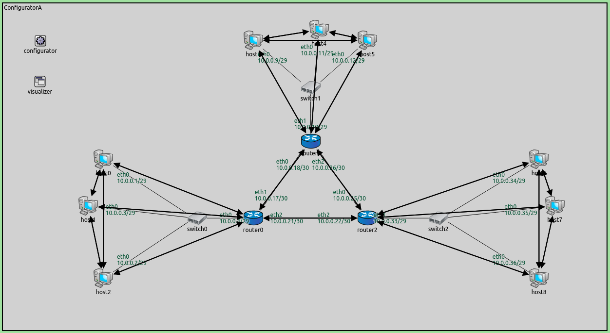
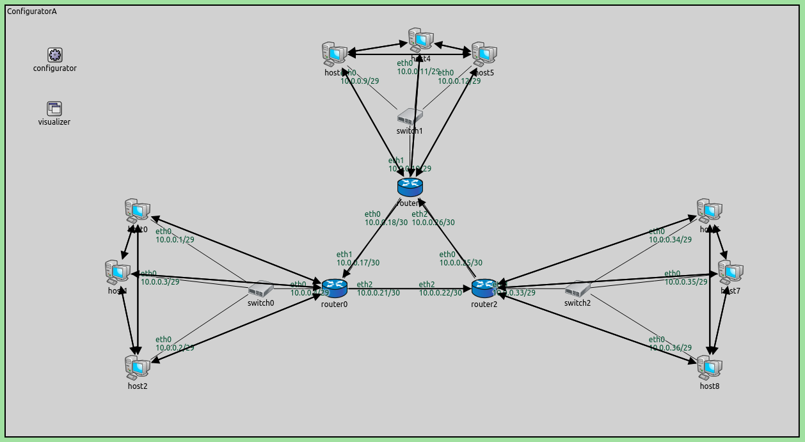

## Goals

Sometimes the configurator's configuration is just almost right.
In such a case it's possible to dump the configuration into a file,
edit it and use the file in place of the original configuration.
This step consists of two parts:

- **Part A** - Dumping the full configuration
- **Part B** - Using the modified configuration

## Part A - Dumping the full configuration

The configurator can be instructed to dump its configuration into a config file,
in the XML configuration format. This contains all the assigned addresses,
routing table entries and members of wireless links, so they can be easily modified.
The modified config file can be used as the XML configuration for subsequent simulation runs.

### Configuration

Both parts in this step use the `ConfiguratorA` network defined in <a srcfile="configurator/ConfiguratorA.ned"/>:

The configuration for this part in omnetpp.ini is the following:

<pre class="snippet" src="../omnetpp.uncommented.ini" from="Step11A" until="####"></pre>

The configurator's `dumpConfig` parameter can be used to dump the configuration into a file.
The parameter's value is the name of the config file.

### Results

Routes to all nodes are visualized on the following image.

The configuration is dumped into <a srcfile="configurator/step11a_dump.xml"/>.
We will modify this config file in the next part.

## Part B - Using the modified configuration

In this part, we edit the config file, and use it as the XML configuration.
The goal is that packets should travel counter-clockwise in the triangle of the three routers,
i.e. each router should forward packets in the triangle through its interface on the right.

### Configuration

The configuration for this part in omnetpp.ini is the following:

<pre class="snippet" src="../omnetpp.uncommented.ini" from="Step11B" until="####"></pre>

The modified config is used as the XML configuration. Since the configuration specifies all routes,
`addStaticRoutes` needs to be set to `false`, so the configurator doesn't add automatic static routes.
A host in each LAN pings another host in the adjacent LAN in the counter-clockwise direction.

The routes in all three routers' routing tables are modified. Routes that would
send packets the wrong way  (i.e. not counter-clockwise in the triangle) are redirected
to the other interface.  In essence, all routers send out packets through their interface
to the right (expect for packets destined to the connecting LAN.)

The modified XML configuration is in <a srcfile="configurator/step11b.xml"/>
(see <a srcfile="configurator/step11a_dump.xml"/> for the original.)
The differences between  the original and the modified config files area displayed below
(the original is shown in red).

### Results

Routes to all nodes are visualized on the following image. Note that arrows point
only counter-clockwise in the triangle.

The ping exchanges highlight the modified routes on the following video:

<video autoplay loop controls onclick="this.paused ? this.play() : this.pause();" src="Step11B_2_cropped.mp4" width="850" height="560"></video>

<!--from #295 zoom 0.77 playback speed 2.5 animation speed none crop 30 70 150 80-->

The packets travel only counter-clockwise in the triangle of the three routers.

Sources: <a srcfile="configurator/omnetpp.ini"/>, <a srcfile="configurator/ConfiguratorA.ned"/>

## Discussion

Use <a href="https://github.com/inet-framework/inet-tutorials/issues/2" target="_blank">this page</a>
in the GitHub issue tracker for commenting on this tutorial.
