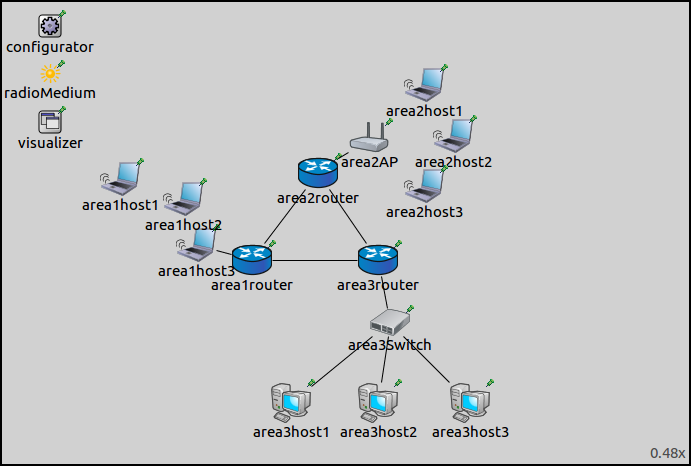

## Goals

Sometimes it is best to configure different parts of a network according to different metrics. This step demonstrates
using the hop count and error rate metrics in a mixed wired/wireless network.

## The model

This step uses the <i>ConfiguratorE</i> network, defined in ConfiguratorE.ned. The network looks like this:

The core of the network is composed of three routers connected to each other, each belonging to an area. There are three areas, each containing a number of hosts,
connected to the area router. 
- Area1 is composed of three <tt>WirelessHosts</tt>, one of them
is connected to the router with a wired connection. 
- Area2 has an <tt>AccessPoint</tt>, and three <tt>WirelessHosts</tt>. 
- Area3 has three <tt>StandardHosts</tt> connected to the
router through a switch.

Since there is no access point in <i>area1</i>, the hosts create an ad-hoc wireless network. They connect to the rest of the network through <i>area1host3</i>,
which has a wired connection to the router.
However, <i>area1host3</i> is not in the communication range of <i>area1host1</i> (illustrated on the image below.) Thus <i>area1host2</i> needs configured to forward
<i>area1host1's</i> packets to <i>area1host3</i>. The error rate metric, rather than hop count, is best suited to configure routes in this LAN. Routes in the rest of the network
can be configured properly based on the hop count metric.

The configuration for this step in omnetpp.ini is the following:

@dontinclude omnetpp.uncommented.ini
@skipline Step12
@until ####

- For hosts in <i>area1</i> to operate in ad-hoc mode, IP forwarding is turned on, and their management modules are set to ad-hoc management.
- <i>area1host1</i> is configured to ping <i>area2host1</i>, which is on the other side of the network.
- Routes to all hosts and communication ranges are visualized.

The XML configuration in step12.xml is the following:

@dontinclude step12.xml
@skipline config
@until config

To have routes from every node to every other node, all nodes must be covered by an autoroute element.
The XML configuration contains two autoroute elements. Routing tables of hosts in <i>area1</i> are configured according to the error rate metric,
while all others according to hop count.

The global <i>addStaticRoutes, addDefaultRoutes and addSubnetRoutes</i> parameters can be specified per interface, with the <interface> element.
These can be set with the <strong>add-static-route</strong>, <strong>add-default-route</strong> and <strong>add-subnet-route</strong> bool parameters.
They are true by default. The global and per-interface settings are in a logical AND relationship, thus both have to be true to take effect.

The default route assumes there is one gateway,
and all nodes on the link can reach it directly. This is not the case for <i>area1</i>, because <i>area1host1</i> is out of range of the gateway host. 
The <i>add-default-route</i> parameter is set to false for the <i>area1</i> hosts.

## Results

The routes are visualized on the following image.

As intended, <i>area1host1</i> connects to the network via <i>area1host2</i>.

The routing table of <i>area1host1</i> is as follows:

<pre class="monospace">
Node ConfiguratorF.area1host1
-- Routing table --
Destination      Netmask          Gateway          Iface             Metric
10.0.0.1         255.255.255.255  10.0.0.19        wlan0 (10.0.0.17) 0
10.0.0.2         255.255.255.255  10.0.0.19        wlan0 (10.0.0.17) 0
10.0.0.5         255.255.255.255  10.0.0.19        wlan0 (10.0.0.17) 0
10.0.0.6         255.255.255.255  10.0.0.19        wlan0 (10.0.0.17) 0
10.0.0.9         255.255.255.255  10.0.0.19        wlan0 (10.0.0.17) 0
10.0.0.10        255.255.255.255  10.0.0.19        wlan0 (10.0.0.17) 0
10.0.0.18        255.255.255.255  10.0.0.19        wlan0 (10.0.0.17) 0
10.0.0.28        255.255.255.255  10.0.0.19        wlan0 (10.0.0.17) 0
10.0.0.33        255.255.255.255  10.0.0.19        wlan0 (10.0.0.17) 0
10.0.0.34        255.255.255.255  10.0.0.19        wlan0 (10.0.0.17) 0
10.0.0.41        255.255.255.255  10.0.0.19        wlan0 (10.0.0.17) 0
10.0.0.16        255.255.255.248  *                wlan0 (10.0.0.17) 0
10.0.0.24        255.255.255.248  10.0.0.19        wlan0 (10.0.0.17) 0
10.0.0.40        255.255.255.248  10.0.0.19        wlan0 (10.0.0.17) 0
</pre>

The gateway is 10.0.0.19 (<i>area1host2</i>) in all rules, except the one where it is *. That rule is for reaching
the other hosts in the LAN directly. This doesn't seem to be according to the error rate metric, but the * rule
matches destinations 10.0.0.18 and 10.0.0.19 only. Since 10.0.0.18 is covered by a previous rule, this one
is actually for reaching 10.0.0.19 directly.

The following video shows `area1host1` pinging `area2host1`:

<video autoplay loop controls onclick="this.paused ? this.play() : this.pause();" src="Step12_2_cropped.mp4" width="850" height="520"></video>
<!--internal video recording playback speed 2 animation speed none zoom 1.0 from sendPing(1) to #1734 crop 140 380 150 440-->

