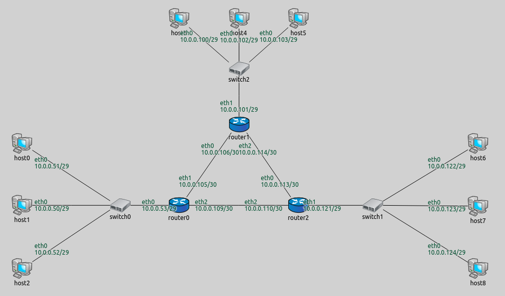

## Goals

Sometimes it might be useful to specify the IP addresses of some nodes with special purpose in the network and leave the rest for the automatic configuration. This helps remembering IP addresses of said nodes. This step demonstrates manually specifying individual IP addresses.

## The model

This step uses the `ConfiguratorA`  network from the previous step. We will assign the 10.0.0.50 address to `host1` 
and 10.0.0.100 to `host3`. The configurator will automatically assign addresses to the rest of the nodes.

### Configuration

The configuration in omnetpp.ini for this step is the following:

<pre class="snippet" src="../omnetpp.uncommented.ini" from="Step2" until="####"></pre>

The XML configuration can be supplied to the `config`  parameter in one of two ways:

- Inline XML using the `xml()`  function. The argument of the function is the XML code.
- External XML file using the `xmldoc()`  function. The argument of the function is the name of the XML configuration file.

In this step, the XML configuration is supplied to the configurator as inline XML. XML configurations contain one `<config>` element. Under this root element there can be
multiple configuration elements, such as the `<interface>`  elements here.
The <interface> element (and other elements) can contain selector attributes, which limit the scope of what interfaces are affected by the <interface> element.
Multiple interfaces can be selected with one <interface> element using the * wildcard.
They can also contain parameter attributes, which deal with the parameters those selected interfaces will have, like IP addresses and
netmasks. Address templates can be specified with one or more 'x' in the address. The 'x' in the IP address and netmask signify that the value is not fixed, but the configurator should choose it automatically.
With these address templates it is possible to leave everything to the configurator or specify everything, and anything in between. The selector attributes used in the XML configuration for this step are detailed below.
- The `hosts`  selector attribute selects hosts. The selection pattern can be full path (e.g. "*.host0") or a module name anywhere in the hierarchy (e.g. "host0"). Only interfaces in the selected host will be affected by the <interface> element.
- The `names`  selector attribute selects interfaces. Only the interfaces that match the specified names will be selected (e.g. "eth0").
- The `address`  parameter attribute specifies the addresses to be assigned. Address templates can be used, where an 'x' in place of an octet means that the value
should be selected by the configurator automatically. The value "" means that the no address will be assigned. Unconfigured interfaces will still have
allocated addresses in their subnets, so they can be easily configured later dynamically.
- The `netmask`  parameter attribute specifies the netmasks to be assigned. Address templates can be used here as well.

All attributes are optional. Attributes not specified are left for the automatic configuration. There are many other attributes available. For the complete list of attributes of the <interface> element
(or any other element), please refer to the <a href="https://omnetpp.org/doc/inet/api-current/neddoc/index.html?p=inet.networklayer.configurator.ipv4.IPv4NetworkConfigurator.html" target="_blank"><strong>IPv4NetworkConfigurator</strong></a> NED documentation.

In the XML configuration for this step, the first two rules state that `host3's`  (hosts="*.host3") interface named 'eth0' (names="eth0") should get the IP address 10.0.0.100 (address="10.0.0.100"), and `host1's`  interface 'eth0' should get 10.0.0.50.
The third rule is the exact copy of the default configuration, which tells the configurator to assign the rest of the addresses automatically.
Note that this is the default rule in two contexts. It is the default rule that the configurator uses when no XML config is specified. Also it is
the last and least specific among the address assignment rules here, thus it takes effect for interfaces that don't match the previous rules.

Note that the order of configuration elements is important, but the configurator doesn't assign addresses in the order of XML interface elements. It iterates
interfaces in the network, and for each interface the first matching rule in the XML configuration will take effect. Thus statements that are positioned earlier in the configuration take precedence over those that come later.

When an XML configuration is supplied, it must contain interface elements in order to assign addresses at all. To make sure the configurator automatically assigns addresses to all interfaces, a rule similar to the one in the default configuration has to be included (unless the intention is to leave some interfaces unassigned.) The default rule should be the **last** one among the interface rules (so the more specific ones override it).

## Results

The assigned addresses are shown in the following image.

As in the previous step, the configurator assigned disjunct subnet addresses. Note that the configurator still assigned addresses sequentially,
i.e. after setting the 10.0.0.100 address to `host3` , it didn't go back to the beginning of the address pool when assigning the
remaining addresses.