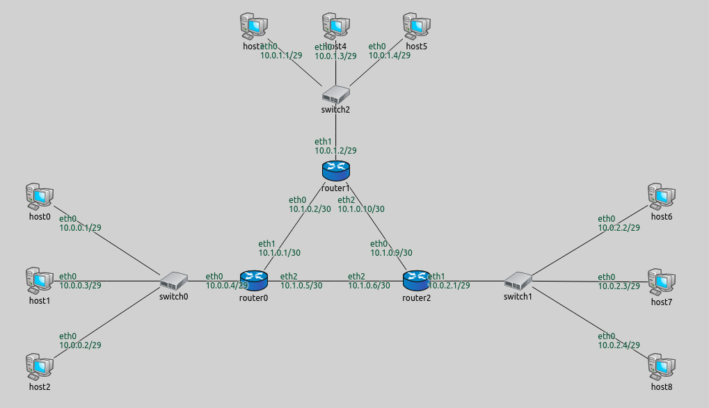

## Goals

Complex networks often contain several subnetworks, and the user may want to
assign specific IP address ranges for them. This step demonstrates how to 
	assign a range of IP addresses to subnets.

## The model

This step uses the `ConfiguratorA` network, as in the previous two steps.
One switch and the connected hosts as a group will be on the same subnet, 
and there are three such groups in the network.

The configuration is the following:

<pre class="snippet" src="../omnetpp.uncommented.ini" from="Step3" until="####"></pre>

This time the XML configuration is supplied in an external file (step3.xml), using the `xmldoc()` function:

<pre class="snippet" src="../step3.xml"></pre>

A brief explanation:

- The first three entries assign IP addresses with different network prefixes to hosts in the three different subnets.

- The next three entries specify for each router that its interface that connects to a subnet should belong in that subnet.
  These entries use the `towards` selector, which selects the interfaces that are connected towards the specified host or hosts.

- The last entry sets the network prefix of interfaces of all routers to be 10.1.x.x.
  The routers' interfaces facing the subnets were assigned addresses by the previous rules,
  so this rule only effects the interfaces facing the other routers. 

These seven rules assign addresses to all interfaces in the network, thus, a default rule is not required.

### Variations

The same effect can be achieved in more than one way. Here is an alternative 
XML configuration (step3alt1.xml) that results in the same address assignment:

<pre class="snippet" src="../step3alt1.xml"></pre>

The `among` selector selects the interfaces of the specified hosts towards the specified 
hosts (the statement `among="X Y Z"` is the same as `hosts="X Y Z" towards="X Y Z"`).

Another alternative XML configuration is the following:

<pre class="snippet" src="../step3alt2.xml"></pre>

This one assigns an address to one host in each of the three subnets. It assigns addresses
o the interfaces of the routers facing the other routers, and includes a copy of the default
configuration. Because `assignDisjunctSubnetAddresses=true`, the configurator puts 
the unspecified hosts, and the subnet facing router interfaces into the same subnet 
as the specified host.

## Results

The assigned addresses are shown on the following image.

The addresses are assigned as intended.
This is useful because it is easy to recognize which group a node belongs to just by looking at its address (e.g. in the logs.)

Sources: <a srcfile="configurator/omnetpp.ini"/>, <a srcfile="configurator/ConfiguratorA.ned"/>

## Discussion

Use <a href="https://github.com/inet-framework/inet-tutorials/issues/2" target="_blank">this page</a>
in the GitHub issue tracker for commenting on this tutorial.
