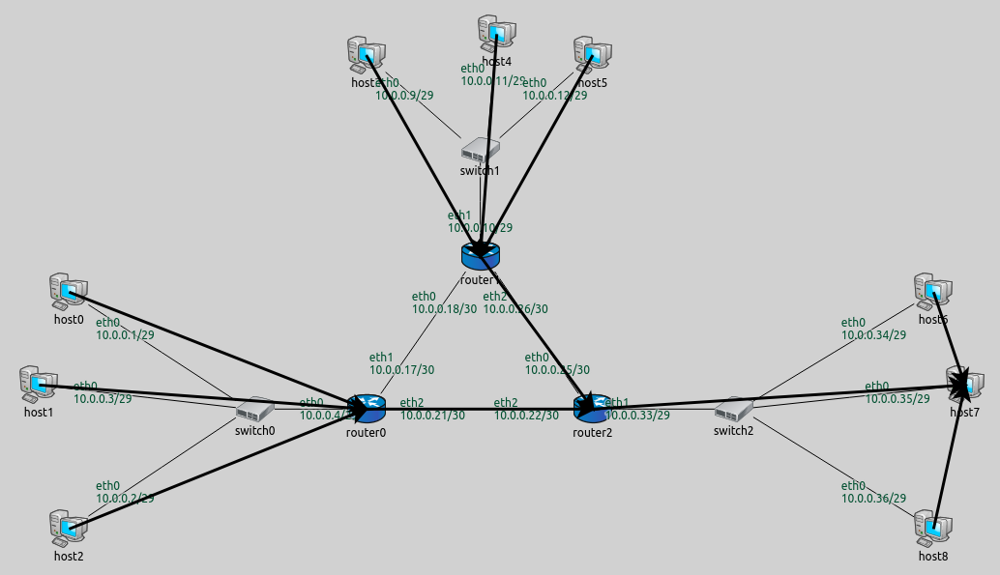

## Goals

Just as with IP addresses, in many cases the configurator sets up routes
in a network properly without any user input.
This step demonstrates the default configuration for routing.

## The model

This step uses the same network as the previous steps, `ConfiguratorA`.
The configuration for this step in omnetpp.ini is the following:

<pre class="snippet" src="../omnetpp.uncommented.ini" from="Step4" until="####"></pre>

The configuration leaves the configurator's parameters at their defaults.
The configurator's parameters concerning static routing are the following:

- `addStaticRoutes = default(true)`: This is the main switch that turns on automatically
  filling routing tables. When this setting is turned off, only routes specified in
  the XML configuration are added, and all the following parameters are ignored.
- `addDefaultRoutes = default(true)`: Add a default route if all routes from
  a node go through the same gateway. This is often the case with hosts, which
  usually connect to a network via a single interface.
- `addSubnetRoutes = default(true)`: Optimize routing tables by adding routes
  towards subnets instead of individual interfaces.
- `optimizeRoutes = default(true)`: Optimize routing tables by merging entries
  where possible.

### Adding traffic

We add some traffic to the network so that we can see which way packets are routed.
We use ping applications for this purpose throughout the tutorial.

In this step, we configure `host1` to ping `host7` in order to see the route between
the two hosts.

### Logging and visualization settings

The `RoutingTableCanvasVisualizer` module (present in the network as a
submodule of `IntegratedCanvasVisualizer`) can be used to visualize
IP routes in the network. Routes are visualized with arrows.
In general, an arrow indicates an entry in the source host's routing table.
It points to the host that is the next hop or gateway for that routing table
entry. The visualization is activated by setting the `RoutingTableVisualizer`'s
`displayRoutingTables` parameter to `true`. The set of routes to be visualized
are selected with the visualizer's `destinationFilter` and `nodeFilter`
parameters. All routes leading towards the selected set of destinations from
the selected set of source nodes are indicated by arrows.
The default setting for both parameters is `"*"`, which visualizes all routes
going from every node to every other node. Visualizing routes from all nodes
to all destinations can often make the screen cluttered.
In this step the `destinationFilter` is set to visualize all routes
heading towards `host7`.

The visualizer annotates the arrows with information about the visualized
route by default. This feature can be customized and toggled on and off
with the visualizer's parameters (discussed in later steps.)

Additional settings pertaining to routing are specified in the `General` configuration
in omnetpp.ini:

<pre class="snippet" src="../omnetpp.uncommented.ini" from="General" until="Wireless"></pre>

The `dumpTopology`, `dumpLinks` and `dumpRoutes` parameters are set to `true`.
These parameter settings instruct the configurator to print to the module output the topology of
the network, the recognized network links, and the routing tables of all nodes,
respectively. Topology describes which nodes are connected to which nodes.
Hosts that can directly reach each other (i.e. the next hop is the destination),
are considered to be on the same link.

### Additional configuration

The `General` configuration also sets up `GlobalARP` to keep the packet exchanges
simpler. `GlobalARP` fills the ARP tables of all nodes in advance, so when
the simulation begins no ARP exchanges are necessary.

The `**.routingTable.netmaskRoutes = ""` line keeps the routing table modules from
adding netmask routes to the routing tables. Netmask routes mean that nodes
with the same netmask but different IP addresses should reach each other directly.
These routes are also added by the configurator, so `netmaskRoutes` is turned off
to avoid duplicate routes.

## Results

The visualized routes are displayed on the following image:

Routes from all nodes to `host7` are visualized. Note that arrows don't go
through switches, because they are not the next hop. When routes are concerned,
switches are transparent L2 devices.

The routing tables are the following (routes visualized on the image above
are highlighted):

<pre class="monospace">
Node ConfiguratorB.host0 (hosts 1-2 are similar)
-- Routing table --
Destination      Netmask          Gateway          Iface            Metric
10.0.0.0         255.255.255.248  *                eth0 (10.0.0.1)       0
*                *                10.0.0.4         eth0 (10.0.0.1)       0

Node ConfiguratorB.host3 (hosts 4-5 are similar)
-- Routing table --
Destination      Netmask          Gateway          Iface            Metric
10.0.0.8         255.255.255.248  *                eth0 (10.0.0.9)       0
*                *                10.0.0.10        eth0 (10.0.0.9)       0

Node ConfiguratorB.host6 (hosts 7-8 are similar)
-- Routing table --
Destination      Netmask          Gateway          Iface            Metric
10.0.0.32        255.255.255.248  *                eth0 (10.0.0.34)      0
<i></i>*                *                10.0.0.33        eth0 (10.0.0.34)      0

Node ConfiguratorB.router0
-- Routing table --
Destination      Netmask          Gateway          Iface            Metric
10.0.0.18        255.255.255.255  *                eth1 (10.0.0.17)      0
10.0.0.22        255.255.255.255  *                eth2 (10.0.0.21)      0
10.0.0.25        255.255.255.255  10.0.0.22        eth2 (10.0.0.21)      0
10.0.0.0         255.255.255.248  *                eth0 (10.0.0.4)       0
10.0.0.32        255.255.255.248  10.0.0.22        eth2 (10.0.0.21)      0
10.0.0.0         255.255.255.224  10.0.0.18        eth1 (10.0.0.17)      0

Node ConfiguratorB.router1
-- Routing table --
Destination      Netmask          Gateway          Iface            Metric
10.0.0.17        255.255.255.255  *                eth0 (10.0.0.18)      0
10.0.0.22        255.255.255.255  10.0.0.25        eth2 (10.0.0.26)      0
10.0.0.25        255.255.255.255  *                eth2 (10.0.0.26)      0
10.0.0.8         255.255.255.248  *                eth1 (10.0.0.10)      0
10.0.0.32        255.255.255.248  10.0.0.25        eth2 (10.0.0.26)      0
10.0.0.0         255.255.255.224  10.0.0.17        eth0 (10.0.0.18)      0

Node ConfiguratorB.router2
-- Routing table --
Destination      Netmask          Gateway          Iface            Metric
10.0.0.18        255.255.255.255  10.0.0.26        eth0 (10.0.0.25)      0
10.0.0.21        255.255.255.255  *                eth2 (10.0.0.22)      0
10.0.0.26        255.255.255.255  *                eth0 (10.0.0.25)      0
10.0.0.8         255.255.255.248  10.0.0.26        eth0 (10.0.0.25)      0
10.0.0.32        255.255.255.248  *                eth1 (10.0.0.33)      0
10.0.0.0         255.255.255.224  10.0.0.21        eth2 (10.0.0.22)      0
</pre>

The * for the gateway means that the gateway is the same as the destination.
Hosts have a routing table entry to reach other nodes on the same subnet directly.
They also have a default route with the router as the gateway for packets sent
to outside-of-subnet addresses. Routers have three rules in their routing tables
for reaching the other routers, specifically, those interfaces of the other routers
that are not facing the hosts.

Below is a video of `host1` pinging `host7`.

<video autoplay loop controls onclick="this.paused ? this.play() : this.pause();" src="Step4_2_cropped.mp4" width="850" height="560"></video>

<!--internal video recording playback speed 1.38 animation speed none
zoom level 0.77 crop: 30 70 150 80-->

Sources: <a srcfile="configurator/omnetpp.ini"/>, <a srcfile="configurator/ConfiguratorA.ned"/>

## Discussion

Use <a href="https://github.com/inet-framework/inet-tutorials/issues/2" target="_blank">this page</a>
in the GitHub issue tracker for commenting on this tutorial.
