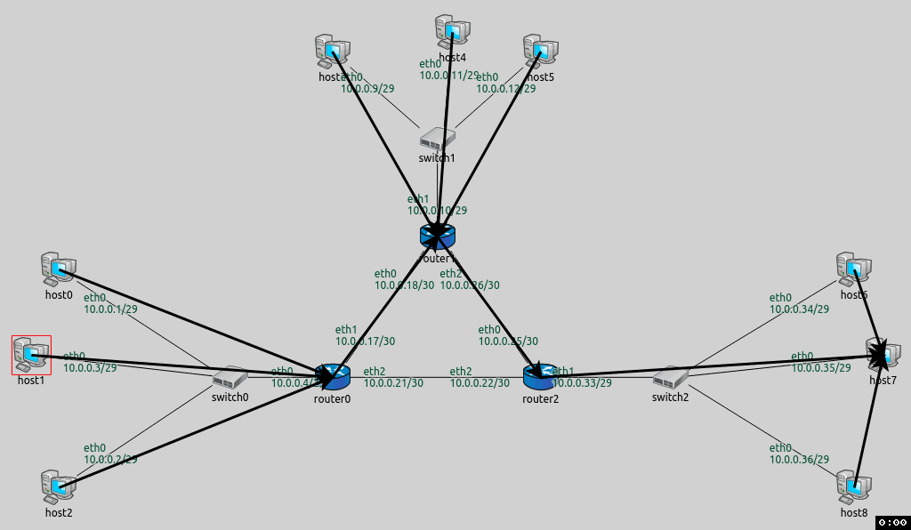

## Goals

The automatic configuration can configure routes properly, but sometimes the user might want to manually override some of the routes.
This step consists of two parts:

- In the <strong>A</strong> part we will override the routes to just one specific host
- In the <strong>B</strong> part we will override routes to a set of hosts

## Part A - Overriding routes to a specific host

Both parts in this step use the <i>ConfiguratorA</i> network (displayed below), just as in the previous steps.
In this part we will override the routes going from the subnet of <i>router0</i> to <i>host7</i>. With the automatic configuration, packets
from <i>router0's</i> subnet would go through <i>router2</i> to reach <i>host7</i> (as in the previous step.) We want them to go through <i>router1</i> instead.

### Configuration

The configuration in omnetpp.ini is the following:

@dontinclude omnetpp.uncommented.ini
@skipline Step5
@until ####

A ping application is added to <i>host0</i>, in addition to the one in <i>host1</i> added in Step 4.
The new app in <i>host0</i> pings <i>host6</i> to demonstrate that only packets sent to <i>host7</i>
are affected by the route override.

For the routes to go through <i>router1</i>, the routing table of <i>router0</i> has to be altered.
The new rules should dictate that packets with the destination of <i>host7</i> (10.0.0.35) should be routed
towards <i>router2</i>. The XML configuration in step5a.xml is the following:

@dontinclude step5a.xml
@skipline <config>
@until </config>

The <route> element describes a routing table entry for one or more nodes in the network.
The <i>hosts</i> optional selector attribute specifies which hosts' routing tables should contain the entry.
There are 5 additional optional parameter attributes. These are the same as in real life routing tables:
address, netmask, gateway, interface, metric.

The <route> element in this XML configuration adds the following rule to <i>router0's</i> routing table:
Packets with the destination of 10.0.0.35/32 should use the interface 'eth1' and the gateway 10.0.0.18 (router2.)

### Results

The routing table of <i>router0</i> (manually added route highlighted):

<pre class="monospace">
Node ConfiguratorB.router0
-- Routing table --
Destination      Netmask          Gateway          Iface            Metric
10.0.0.18        255.255.255.255  *                eth1 (10.0.0.17) 0
10.0.0.22        255.255.255.255  *                eth2 (10.0.0.21) 0
10.0.0.25        255.255.255.255  10.0.0.22        eth2 (10.0.0.21) 0
10.0.0.35        255.255.255.255  10.0.0.18        eth1 (10.0.0.17) 0
10.0.0.0         255.255.255.248  *                eth0 (10.0.0.4)  0
10.0.0.32        255.255.255.248  10.0.0.22        eth2 (10.0.0.21) 0
10.0.0.0         255.255.255.224  10.0.0.18        eth1 (10.0.0.17) 0
</pre>

The routing table of <i>router0</i> in the previous step had six entries. Now it has seven,
as the rule specified in the XML configuration has been added (highlighted).
This and the last rule both match packets to <i>host7</i> but the manually added route takes effect
because it comes earlier.

The following animation depicts <i>host1</i> pinging <i>host7</i>, and <i>host0</i> pinging <i>host6</i>. Routes to <i>host7</i> are visualized.

<!--TODO delete-->

<video autoplay loop controls onclick="this.paused ? this.play() : this.pause();" src="Step5A_1_cropped.mp4" width="850" height="560"></video>
<!--internal video recording run until 1s playback speed 1.5 animation speed none zoom 0.77 crop 30 70 150 80-->

Note that only routes towards <i>host7</i> are diverted at <i>router0</i>. The ping reply packet uses the original route between <i>router0</i> and <i>router2</i>.
Ping packets to <i>host6</i> (and back) also use the original route.

## Part B - Overriding routes to a set of hosts

In this part, we will override routes going from the subnet of <i>hosts 0-2</i> to the subnet of <i>hosts 6-8</i>.
These routes will go through <i>router1</i>, just as in Part A.

### Configuration

The configuration in omnetpp.ini:

@dontinclude omnetpp.uncommented.ini
@skipline Step5B
@until ####

As in Part A, the routing table of <i>router0</i> has to be altered, so that packets to <i>hosts 6-8</i> go towards <i>router1</i>. 
The XML configuration in step5b.xml is as follows:

@dontinclude step5b.xml
@skipline config
@until config

The <route> element specifies a routing table entry for <i>router0</i>. The destination is 10.0.0.32 with netmask 255.255.255.248,
which designates the addresses of hosts 6-8. The gateway is <i>router1's</i> address, the interface is the one connected towards
<i>router1</i> (eth1). This rule is added to <i>router0's</i> routing table <strong>in addition</strong>
to the rule added automatically by the configurator. They match the same packets, but the parameters are different (see at the result section
below.) The manually added routes come before the automatic ones in routing tables, thus the manual ones take precedence.

### Results

Here is the routing table of <i>router0</i> (the manually added route highlighted):

<pre class="monospace">
Node ConfiguratorB.router0
-- Routing table --
Destination      Netmask          Gateway          Iface            Metric
10.0.0.10        255.255.255.255  10.0.0.18        eth1 (10.0.0.17) 0
10.0.0.18        255.255.255.255  *                eth1 (10.0.0.17) 0
10.0.0.22        255.255.255.255  *                eth2 (10.0.0.21) 0
10.0.0.25        255.255.255.255  10.0.0.22        eth2 (10.0.0.21) 0
10.0.0.26        255.255.255.255  10.0.0.18        eth1 (10.0.0.17) 0
10.0.0.33        255.255.255.255  10.0.0.22        eth2 (10.0.0.21) 0
10.0.0.0         255.255.255.248  *                eth0 (10.0.0.4)  0
10.0.0.8         255.255.255.248  10.0.0.18        eth1 (10.0.0.17) 0
10.0.0.32        255.255.255.248  10.0.0.18        eth1 (10.0.0.17) 0
10.0.0.32        255.255.255.248  10.0.0.22        eth2 (10.0.0.21) 0
</pre>

The following is the animation of <i>host1</i> pinging <i>host7</i> and <i>host0</i> pinging <i>host6</i>, similarly
to Part A. Routes to <i>host7</i> are visualized.

<video autoplay loop controls onclick="this.paused ? this.play() : this.pause();" src="Step5B_1_cropped.mp4" width="850" height="560"></video>
<!--internal video recording run until 1s playback speed 1.5 animation speed none zoom 0.77 crop 30 70 150 80-->

This time both packets outbound to <i>hosts 6 and 7</i> take the diverted route, the replies come back on the original route.
