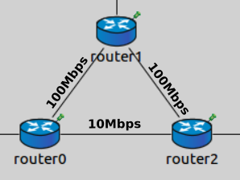
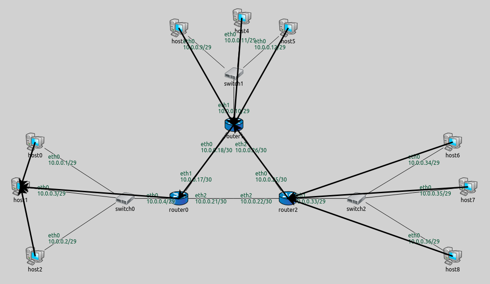
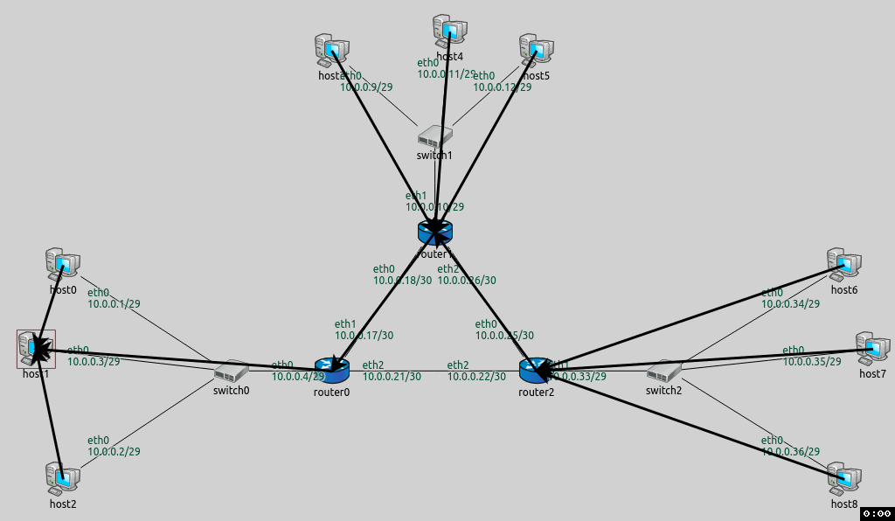
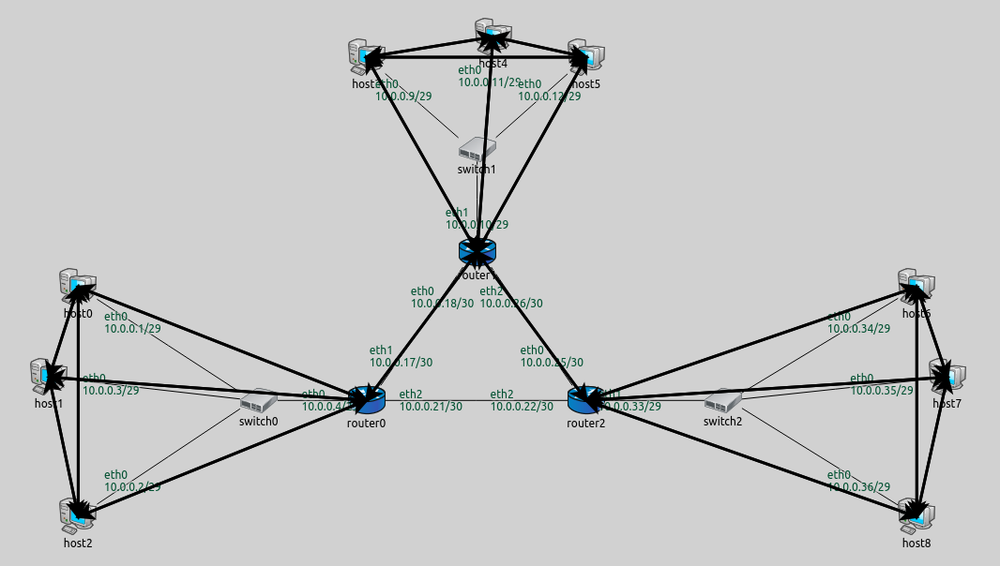
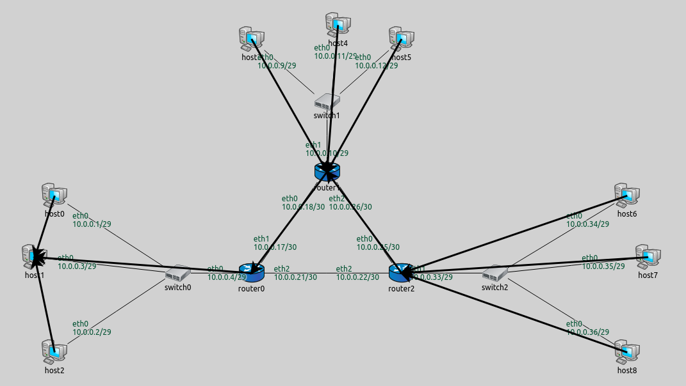

## Goals

When setting up routes, the configurator uses the shortest path algorithm. By default, paths are optimized for hop count.
However, there are other cost functions available, like data rate, error rate, etc. This step consists of two parts:
- <strong>Part A</strong> demonstrates using the data rate metric for automatically setting up routes.
- <strong>Part B</strong> demonstrates instructing the configurator not to use a link when setting up routes, by manually specifying link cost.

## Part A: Using the data rate metric

When setting up routes, the configurator first builds a graph representing the network topology. 
A vertex in the graph represents a network node along with all of its interfaces. An edge represents a wired or wireless connection
between two network interfaces. When building the network topology, wireless nodes are considered to be connected to all other wireless
nodes in the same wireless network.

After the graph is built, the configurator assigns weights to vertices and edges according to the configured metric.
Vertices that represent network nodes with IP forwarding turned off have infinite weight, all others have 0.
Finally, the shortest path algorithm is used to determine the routes based on the assigned weights.

The available metrics are the following:
- <strong>hopCount</strong>: routes are optimized for hop count. All edges have a cost of 1. This is the default metric.
- <strong>dataRate</strong>: routes prefer connections with higher bandwidth. Edge costs are inversely proportional to the data rate of the connection.
- <strong>delay</strong>: routes are optimized for lower delay. Edge costs are proportional to the delay of the connection.
- <strong>errorRate</strong>: routes are optimized for smaller error rate. Edge costs are proportional to the error rate of the connection. This is mostly useful
for wireless networks because the error rate of wired connections is usually negligible.

### Configuration

The configuration for this step extends Step 4, thus it uses the `ConfiguratorA` network. The configuration in omnetpp.ini is the following:
<!TODO: network image?>

@dontinclude omnetpp.uncommented.ini
@skipline Step6A
@until ####

Below is the XML configuration in step6a.xml:

@dontinclude step6a.xml
@skipline config
@until config

The XML configuration contains the default rule for IP address assignment, and an <autoroute> element that configures the metric to be used.
The <autoroute> element specifies parameters for automatic static routing table configuration. If no <autoroute> element is specified, the configurator
assumes a default that affects all routing tables in the network, and computes shortest paths to all interfaces according to the hop count metric.
The <autoroute> element can contain the following attributes:
- <strong>sourceHosts</strong>: Selector attribute that selects which hosts' routing tables should be modified. The default value is <tt>"**"</tt>.
- <strong>destinationInterfaces</strong>: Parameter attribute that selects destination interfaces for which the shortest paths will be calculated.
The default value is <tt>"**"</tt>.
- <strong>metric</strong>: Parameter attribute that sets the metric to be used when calculating shortest paths. The default value is <tt>"hopCount"</tt>.

There are subelements available in <autoroute>, which will be discussed in Part B.

Here the <autoroute> element specifies that routes should be added to the routing table of each host and the metric should be <i>dataRate</i>. The configurator assigns weights to the graph's edges that are inversely proportional to the data rate of the network links.
This way route generation will favor routes with higher data rates.

Note that <i>router0</i> and <i>router2</i> are connected with a 10 Mbit/s ethernet cable, while <i>router1</i> connects to the other routers with
100 Mbit/s ethernet cables. Since routes are optimized for data rate, packets from <i>router0</i> to <i>router2</i> will go via <i>router1</i> because this path has higher bandwidth.

### Results

The following image shows the backward routes towards <i>host1</i>.
The resulting routes are similar to the ones in Step 5B. The difference is that routes going backward, from <i>hosts 6-8</i> to <i>hosts 0-2</i>, go through <i>router1</i>. No traffic is routed between <i>router0</i> and <i>router2</i> at all (as opposed to Step 4 and 5.)

The routing table of <i>router0</i> is as follows:

<pre class="monospace">
Node ConfiguratorA.router0
-- Routing table --
Destination      Netmask          Gateway          Iface            Metric
10.0.0.18        255.255.255.255  *                eth1 (10.0.0.17) 0
10.0.0.0         255.255.255.248  *                eth0 (10.0.0.4)  0
10.0.0.0         255.255.255.192  10.0.0.18        eth1 (10.0.0.17) 0
</pre>

The first two rules describe reaching <i>router1</i> and <i>hosts 0-2</i> directly. The last rule specifies that traffic to any other destination
should be routed towards <i>router1</i>.

The routing table of <i>router2</i> is similar:

<pre class="monospace">
Node ConfiguratorA.router2
-- Routing table --
Destination      Netmask          Gateway          Iface            Metric
10.0.0.26        255.255.255.255  *                eth0 (10.0.0.25) 0
10.0.0.32        255.255.255.248  *                eth1 (10.0.0.33) 0
10.0.0.0         255.255.255.224  10.0.0.26        eth0 (10.0.0.25) 0
</pre>

The following animation shows <i>host1</i> pinging <i>host7</i> and <i>host0</i> pinging <i>host6</i>. Routes towards <i>host1</i> are visualized.
The packets don't use the link between <i>router0</i> and <i>router2</i>.

<!--TODO delete-->

@htmlonly
<video autoplay loop controls onclick="this.paused ? this.play() : this.pause();" src="Step6A_1_cropped.mp4" width="850" height="560"></video>
<!--internal video recording run until 1s playback speed 1.5 animation speed none zoom 0.77 crop 30 70 150 80-->
@endhtmlonly

One can easily check that no routes go through the link between <i>router0</i> and <i>router2</i> by setting the destination filter to "*" in the visualizer.
This indicates all routes in the network:

@endhtmlonly

## Part B - Manually specifying link cost

This part configures the same routes as Part A, where routes between <i>router0</i> and <i>router2</i> lead through <i>router1</i>.

The configurator is instructed not to use the link between <i>router0</i> and <i>router2</i> when setting up routes, by specifying the cost of the link to
be infinite.

### Configuration

The configuration for this step in omnetpp.ini is the following:

@dontinclude omnetpp.uncommented.ini
@skipline Step6B
@until ####

The XML configuration in step6b.xml is as follows:

@dontinclude step6b.xml
@skipline config
@until config

The <autoroute> elements can also contain the following optional subelements, which can be used to specify costs in the graph:
- <strong><node></strong>: Specifies cost parameters to network nodes. The <strong>hosts</strong> selector
attribute selects which hosts are affected, and the <strong>cost</strong> parameter sets their costs. Both attributes are mandatory.
- <strong><link></strong>: Specifies cost parameters to network links. The <strong>interfaces</strong> selector
attribute selects which links are affected, by specifying an interface they belong to. The <strong>cost</strong> parameter
sets the cost. Both attributes are mandatory.

This XML configuration specifies the metric to be hop count, and sets the cost of <i>router0's</i> eth2 interface to infinite.
This affects the link between <i>router0</i> and <i>router2</i> - no routes should go through it.

### Results

The routes towards <i>host1</i> are visualized on the following image:

The routes are the same as in Part A, where the data rate metric was used, and routes didn't use the 10Mbps link between <i>router0</i> and <i>router2</i>.
In this part, the link between <i>router0</i> and <i>router2</i> is "turned off" by specifying an infinite cost for it.

<video autoplay loop controls onclick="this.paused ? this.play() : this.pause();" src="Step6A_1_cropped.mp4" width="850" height="560"></video>
<!--internal video recording run until 1s playback speed 1.5 animation speed none zoom 0.77 crop 30 70 150 80-->
