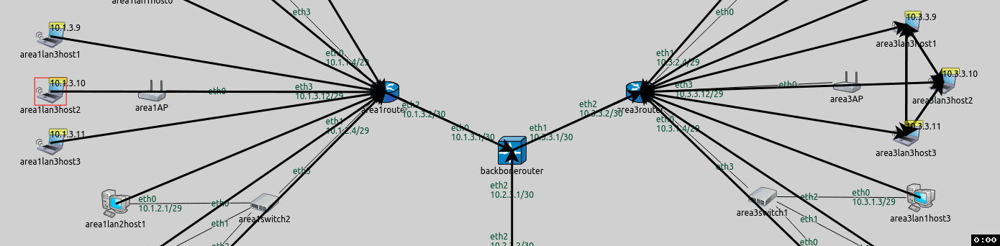

## Goals

This step demonstrates routing table configuration in a mixed wired/wireless network. This step consists of two parts:
- Part A: Determining members of wireless networks with the <wireless> element
- Part B: Determining members of wireless networks by SSID

## Part A: Using the <wireless> element

The configurator assumes that interfaces of wireless nodes in the same wireless network can reach each other directly.
It can determine which nodes belong to a wireless network in two ways:
- It looks at the <i>default_ssid</i> parameter in nodes' agent submodule. Nodes with the same SSID are assumed to be in the same wireless network.
- Members of wireless networks can be specified by the <wireless> element in the XML configuration. In the <wireless> element, the <strong>hosts</strong> and <strong>interfaces</strong> selector attributes can be used to specify members.

Note that nodes need to use the same radio medium module to be in the same wireless network.

### Configuration

This step uses the <i>ConfiguratorC</i> network defined in ConfiguratorC.ned. The network is displayed on the following image.

The <i>ConfiguratorD</i> network extends <i>ConfiguratorC</i> by adding two wireless LANs, <i>area1lan3</i> and <i>area3lan3</i>. The additional LANs consist of an <tt>AccessPoint</tt>
and three <tt>WirelessHosts</tt>.

The default SSID settings of all wireless nodes is "SSID". By default,
the configurator would put them in the same wireless network, and assume that they can all reach each other directly. This would be reflected
in the routes, hosts in <i>area1lan3</i> would reach hosts in <i>area3lan3</i> directly. This is obviously wrong, because they are out of
range of each other. The two LANs need to be in
two different wireless networks.

Here is the configuration for this step in omnetpp.ini:

@dontinclude omnetpp.uncommented.ini
@skipline Step8
@until ####

A wireless host in <i>area1</i> is configured to ping a wireless host in <i>area3</i>, this helps in visualizing routes.

There is a setting in the <i>General</i> configuration pertaining to wireless networks: the control bit rate of all wireless nodes is set to 54 Mbps for faster ACK transmissions.

@dontinclude omnetpp.uncommented.ini
@skipline General
@until ####

The XML configuration in step8a.xml is the following:

@dontinclude step8a.xml
@skipline config
@until config

The XML configuration uses the same hierarchical addressing scheme as in Step 7. The two wireless LANs are specified to be in separate wireless networks. Note that the wireless interfaces of the access points also belong to the wireless networks.

### Results

The addresses and routes are indicated on the following image. Routes leading towards hosts <i>area3lan3</i> are visualized.

Wireless hosts connect to the router through the access points. The access points are L2 devices, similar to switches, so they are transparent for
the routing table visualizer arrows. Wireless hosts get associated with their corresponding access points before they can communicate with the rest of the network.

On the following animation, <i>area1lan3host2</i> pings <i>area3lan3host2</i>. Transmissions are sent to all wireless nodes, but only those in communication range
can receive them correctly (i.e. nodes in the same LAN).

<!--TODO: delete-->

<!TODO: outdated gif>

<video autoplay loop controls onclick="this.paused ? this.play() : this.pause();" src="Step8A_1_cropped.mp4" width="850px" height="280"></video>
<!--internal video recording playback speed 2 animation speed none crop 210 360 50 30-->

This is how the routes would look like if the XML configuration didnt contain the <wireless> elements:

There are no routes visualized between the <i>backbonerouter</i> and <i>area3router</i>, because routes towards <i>area3lan3</i> go via <i>area1router</i>.
<i>Area3lan3</i> can be reached from the <i>backbonerouter</i> in two ways:
- <i>area1router -> area1AP -> area3lan3</i> (<i>area1AP</i> reaches <i>area3lan3</i> directly since they are assumed to be in the same wireless network)
- <i>area3router -> area3AP -> area3lan3</i>

In both ways, <i>area3lan3</i> is two hops away from the <i>backbonerouter</i>. Routes are configured according to hop count, and the configurator chose the first way.

## Part B - Using SSID

In this part, the SSID is used to put the two wireless LANs in two different wireless networks.

### Configuration

The configuration for this part extends Part A. The configuration in omnetpp.ini is the following:

@dontinclude omnetpp.uncommented.ini
@skipline Step8B
@until ####

The XML configuration in step8b.xml (displayed below) is the same as the XML configuration for Part A, except there are no <wireless> elements that defined wireless networks.
They are not needed because different SSIDs are configured for the members of the two wireless LANs.

@dontinclude step8b.xml
@skipline config
@until config

### Results

The results are the same as in the previous part. The two wireless LANs are considered to be different wireless networks.
