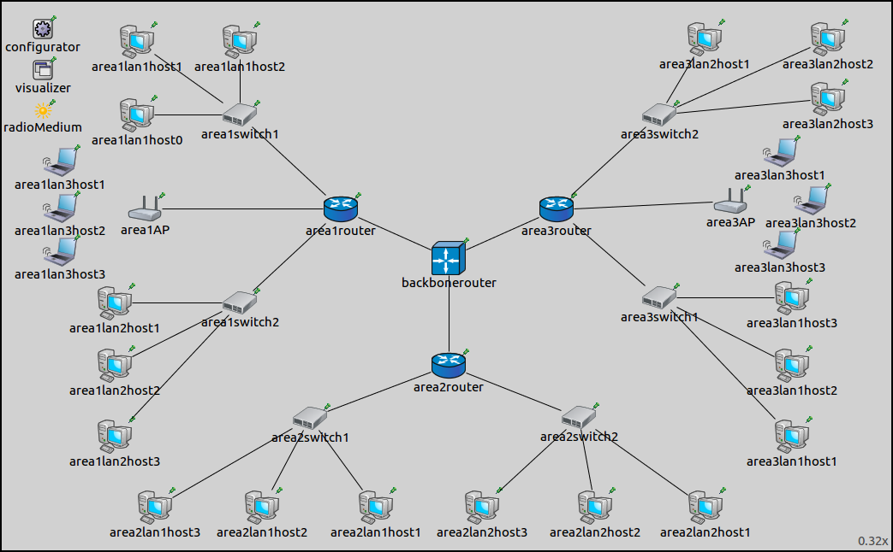

## Goals

Configuring the whole network is not always desirable, because some part of the
network should rather be configured dynamically. In this step, some wired and
wireless LANs' addresses are left unspecified by the configurator,
and they get addresses with DHCP.

## The model

This step uses the `ConfiguratorC` network, defined in <a srcfile="configurator/ConfiguratorC.ned"/>.

The configuration for this step in omnetpp.ini is the following:

<pre class="snippet" src="../omnetpp.uncommented.ini" from="Step9" until="####"></pre>

It boils down to the following:

- Similarly to Step 8B, members of the two wireless LANs are specified by SSID.
- `Area1lan3host2` is configured to ping `area3lan3host3`.
  The ping application is delayed, so it starts sending pings after the hosts
  associated with the access points and got their addresses from the DHCP servers.
- `DHCPServer` submodules are added to the area routers. The DHCP server
  is configured to listen on the interface connecting to the unspecified LAN.
  The interface's netmask is the DHCP server's address range.
- `DHCPClient` submodules are added to the LANs which are unspecified
  by the configurator. There is one such LAN in each area, they are
  `area1lan3`, `area2lan1` and `area3lan3`. Hosts in these LANs get
  the addresses from the DHCP server in the corresponding area router.
- Routes to `area3lan3host3` are visualized.

The XML configuration in step9.xml is the following:

<pre class="snippet" src="../step9.xml"></pre>

Addresses are assigned hierarchically. Five LANs in the network have addresses
assigned by the configurator. Three LANs get their addresses from DHCP servers,
their interfaces are left unspecified by the configurator.
This is accomplished by the lack of address assignment rules for these hosts
in the XML configuration. The area routers' interfaces connecting to the
latter LANs need to be specified in order to have correct routes to these
LANs. Additionally, the addresses for these interfaces need to be assigned specifically,
and they have to fall in the configured DHCP server address ranges.

## Results

The addresses and routes are visualized below. The state of the network
at the start of the simulation is shown on the following image:

The hosts of `area1lan3`, `area2lan1` and `area3lan3` have unspecified addresses.
The routing tables of all hosts contain subnet routes to these three LANs.
Since these hosts don't have addresses at the start of the simulation,
there are no routes leading to `area3lan3host2` that can be visualized.

Though the hosts in the three LANs have unspecified addresses, subnet routes
leading to these LANs are added to the routing tables of all hosts.
The addresses for the interfaces connecting to these LANs have a netmask assigned
so there are addresses allocated for the unspecified hosts.
For example, `area1router`'s `eth3` interface has the address 10.1.4.1/29,
and has four addresses allocated (`10.1.4.2`..`5`).

The routing tables of `area1lan3host2`, `area1router` and `backbonerouter`
are the following (routes for reaching the unspecified hosts are highlighted):

<pre class="monospace">
Node ConfiguratorC.area1lan3host2
-- Routing table --
Destination      Netmask          Gateway          Iface            Metric
10.1.3.0         255.255.255.248  *                wlan0 (unspec)        0
<i></i>*                *                10.1.3.1         wlan0 (unspec)        0

Node ConfiguratorC.area1router
-- Routing table --
Destination      Netmask          Gateway          Iface            Metric
10.1.0.1         255.255.255.255  *                eth2 (10.1.0.2)       0
10.1.1.0         255.255.255.248  *                eth0 (10.1.1.4)       0
10.1.2.0         255.255.255.248  *                eth1 (10.1.2.4)       0
10.1.3.0         255.255.255.248  *                eth3 (10.1.3.1)       0
10.2.0.0         255.254.0.0      10.1.0.1         eth2 (10.1.0.2)       0

Node ConfiguratorC.backbonerouter
-- Routing table --
Destination      Netmask          Gateway          Iface            Metric
10.1.0.2         255.255.255.255  *                eth1 (10.1.0.1)       0
10.2.0.2         255.255.255.255  *                eth0 (10.2.0.1)       0
10.3.0.2         255.255.255.255  *                eth2 (10.3.0.1)       0
10.1.0.0         255.255.252.0    10.1.0.2         eth1 (10.1.0.1)       0
10.2.0.0         255.255.252.0    10.2.0.2         eth0 (10.2.0.1)       0
10.3.0.0         255.255.252.0    10.3.0.2         eth2 (10.3.0.1)       0
</pre>

Note:

- `area1lan3host2` has a default route for reaching the other hosts in the LAN.
- `area1Router` has a route for reaching hosts in `area1lan3`, and a default route
  for reaching area 2 and area 3.
- `backbonerouter` has subnet routes to each area.

In the following video, `area1lan3host2` sends a ping packet to `area3lan3host2`:

<video autoplay loop controls onclick="this.paused ? this.play() : this.pause();" src="Step9_2.mp4"></video>

No routes are visualized initially, because `area3lan3host2` (the destination of
route visualization) has an unspecified IP address. When it gets an address
from the DHCP server, the routes leading towards `area3lan3host2` appear.

Sources: <a srcfile="configurator/omnetpp.ini"/>, <a srcfile="configurator/ConfiguratorC.ned"/>

## Discussion

Use <a href="https://github.com/inet-framework/inet-tutorials/issues/2" target="_blank">this page</a>
in the GitHub issue tracker for commenting on this tutorial.
