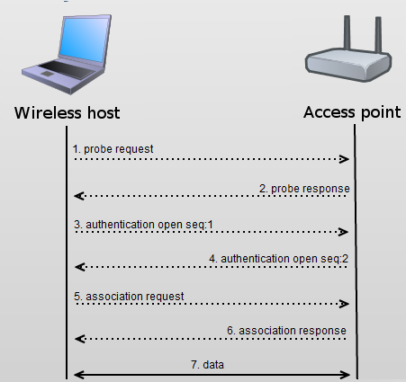

## Goals
In wifi infrastructure mode, wireless nodes have to be associated with an access point 
to be able to communicate with other nodes on the same network. The association 
may change over time, or at a time there might be several access points 
for a wireless node to associate with. It can be useful to be able to display 
information about wifi association e.g. the SSID above network node.
In this step, we enable displaying wifi association.

## The model

### Wifi association process
The following image shows the wifi association process:

### Visualizer
We configure `visualizer` as follows:

<pre class="snippet" src="../omnetpp.ini" from="\[Config Visualization09\]" until="#---"></pre>

Wifi association is displayed by `Ieee80211Visualizer`. We enable it 
by setting `displayAssociations` to *true*. Wifi association is visualized 
as a signal sign icon. We set `displacementHint` to *"topCenter"* 
to place the association icon above the node to center.

## Results

<video autoplay loop controls onclick="this.paused ? this.play() : this.pause();" src="step9_result_2d_assoc.mp4"></video>

association process

<!--

In Module view mode we can monitor the association process, we see all messages between the nodes.
When a pedestrian send an <tt>Assoc</tt> message, the access point in its communication range receive that, and a signal sign appear above the access point.
In response to this <tt>Assoc</tt> message, the access point reply with an <tt>AssocResp-</tt> message.
If the association is successful it's <tt>AssocResp-OK</tt> and a signal sign appear above that pedestrian who wants to associate with the access point.

In 3D view mode as a result of the association process the signal sing appears above the appropriate network node.
-->

Sources: <a srcfile="visualization/omnetpp.ini" />, <a srcfile="visualization/VisualizationD.ned" />
