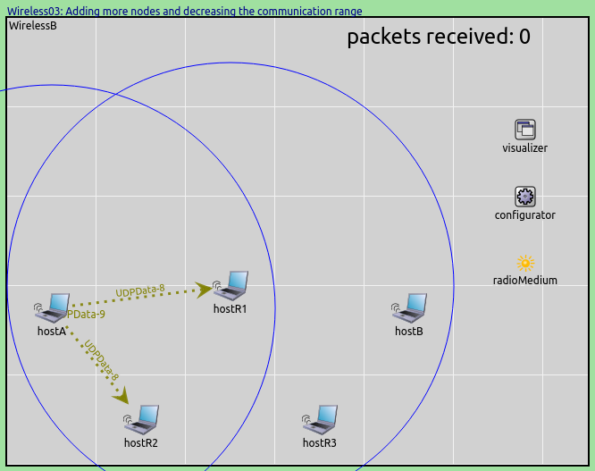

## Goals

Later in this tutorial, we'll want to turn our model into an ad-hoc network
and experiment with routing. To this end, we add three more wireless nodes,
and reduce the communication range so that our two original
hosts cannot reach one another directly. In later steps, we'll set up
routing and use the extra nodes as relays.

## The model

We need to add three more hosts. This could be done by copying and editing the
network used in the previous steps, but instead we extend `WirelessA` into
`WirelessB` using the inheritance feature of NED:

<pre class="snippet" src="../WirelessB.ned" from="network WirelessB"></pre>

We decrease the communication range of the radios of all hosts to 250
meters. This will make direct communication between hosts A and B
impossible, because their distance is 400 meters. The recently added hosts
are in the correct positions to relay data between hosts A and B, but
routing is not yet configured. The result is that hosts A and B will not be
able to communicate at all.

The configuration:

<pre class="snippet" src="../omnetpp.ini" from="Config Wireless03" until="#---"></pre>

## Results

When we run the simulation, blue circles confirm that hosts R1 and R2 are the only
hosts in the communication range of host A. Therefore they are the only ones that
receive host A's transmissions. This is indicated by the dotted arrows
connecting host A to R1 and R2, respectively, representing recent successful
receptions in the physical layer.

Host B is in the transmission range of host R1, and R1 could potentially relay A's packets,
but it drops them, because routing is not configured yet (it will be configured
in a later step). Therefore no packets are received by host B.

Host R1's MAC submodule logs indicate that it is discarding the received packets, as they are
not addressed to it:

**Number of packets received by host B: 0**

Sources: <a srcfile="wireless/omnetpp.ini" />, <a srcfile="wireless/WirelessB.ned" />

## Discussion

Use <a href="https://github.com/inet-framework/inet-tutorials/issues/1" target="_blank">this page</a>
in the GitHub issue tracker for commenting on this tutorial.